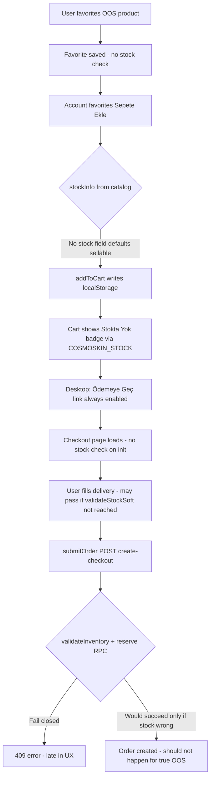

# COSMOSKIN I1 — Inventory Availability & Checkout Blocking Audit Plan

**Date:** 2026-07-06  
**Batch:** I1 only (audit + plan)  
**Status:** Plan complete — **not implemented**

---

## Executive summary

The reported bug is **real and reproducible by design gaps in the frontend**, not because server-side checkout lacks inventory checks entirely. An out-of-stock product can be favorited (expected), added to cart from account favorites (bug), shown as “Stokta Yok” in cart (partial), and the customer can still navigate checkout UI and click through steps (bug). **`create-checkout.js` already performs server-side inventory validation and atomic reservation**, so a final order/payment should fail — but only at the last API call, with a generic message and after the customer has already progressed through checkout.

I1 must make stock enforcement **consistent end-to-end**: block add-to-cart, block checkout navigation, revalidate on checkout load/submit, and keep **fail-closed server enforcement** as the ultimate gate.

---

## Files inspected

| Area | Files |
|------|-------|
| Stock core | `functions/api/_lib/inventory.js`, `functions/api/inventory.js`, `functions/api/inventory/check.js` |
| Checkout server | `functions/api/create-checkout.js` |
| Reservation/release | `functions/api/cron/release-expired-inventory.js`, `functions/api/_lib/commerce-finalization.js`, `functions/api/_lib/order-cancellation.js`, `functions/api/admin/orders.js`, `functions/api/admin/orders/[id]/status.js` |
| Admin inventory | `functions/api/admin/inventory.js`, `functions/api/admin/inventory/[slug].js`, `functions/api/admin/inventory/adjust.js`, `functions/api/admin/inventory/health.js` |
| PDP/PLP stock UI | `assets/inventory-client.js`, `assets/mobile-redesign.js` |
| Cart/checkout UI | `assets/master-upgrade.js`, `assets/checkout-flow.js`, `assets/commerce.js`, `assets/phase6-commerce.js` |
| Account favorites | `assets/account-dashboard.js`, `functions/api/account/favorites.js`, `functions/api/account/summary.js`, `favorites.html` |
| Catalog (not stock) | `functions/api/_lib/catalog.js`, `assets/products-data.js`, `products.json` |
| Schema/RPC | `supabase/migrations/20260510_operations_inventory_orders_shipments.sql`, `20260616_atomic_inventory_reservation.sql`, `20260629_cosmoskin_checkout_bank_transfer_final_fix.sql`, `20260704_h0_live_payment_rpc_hotfix.sql` |
| Tests | `tests/local-integration.test.mjs` (inventory + checkout partial coverage) |

**Not modified in I1 plan:** coupon logic, refund logic, admin auth/RBAC, bank transfer B1/B2, email, return attachments, unrelated admin UI.

---

## 1. Product stock source (trusted)

### Canonical source

| Question | Answer |
|----------|--------|
| Trusted stock table | **`product_inventory`** |
| Stock on products catalog? | **No** — `products.json` / `COSMOSKIN_PRODUCTS` have price/identity only; no authoritative stock |
| Per product or variant? | **Per `product_slug`** (one inventory row per catalog slug; no SKU variants) |
| Reserved quantities? | **Yes** — `stock_reserved` |
| Available stock formula | **`available_stock = max(0, stock_on_hand - stock_reserved)`** (`normalizeInventoryRow()` in `inventory.js`) |
| Public read API | `GET /api/inventory?product_slugs=...` |
| Server check API | `POST /api/inventory/check` → `buildCheckItem()` |
| Inactive/draft products | `product_inventory.status` must be `active` for purchase; catalog-only products without inventory row are treated as **not purchasable** in `buildCheckItem()` |
| Favoriting OOS product | **Allowed** — `user_favorites` has no stock gate (`functions/api/account/favorites.js`) |

### Admin stock updates

- `PATCH /api/admin/inventory/[slug]` and `POST /api/admin/inventory/adjust` → `setInventory()` / `adjustInventory()`
- Writes `stock_on_hand`, optional `status`, `allow_backorder`; logs `inventory_movements`
- Restock triggers `notifyRestockAlerts()` when `available_stock` goes from 0 → positive

### Important distinction

There are **two parallel frontend stock models**:

1. **Live inventory** (`window.COSMOSKIN_STOCK` from `inventory-client.js`) — reads `/api/inventory` + `/api/inventory/check`
2. **Static catalog stock** (`stockInfo()` in `account-dashboard.js`) — reads optional `product.stock` / `stock_status` fields that are **usually absent** → defaults to **sellable**

This split is the primary root cause for favorites.

---

## 2. Current favorites behavior

### Account favorites (`/account/profile.html?tab=favorites`)

| Behavior | Current state | Expected |
|----------|---------------|----------|
| Favorite while OOS | Allowed | Allowed |
| Stock display | **Hidden** (`hideStock: true` in `renderFavorites()`) | Show “Stokta yok” badge; optional restock CTA |
| Add-to-cart button | Uses `stockInfo(product).sellable` from **catalog**, not inventory API | Disabled when OOS; label “Stokta yok” |
| Add-to-cart action | `addToCart()` only checks `stockInfo()`; writes `localStorage` cart directly | Must call `COSMOSKIN_STOCK.validateAdd()` or equivalent server check |
| Same function as PDP? | **No** — PDP uses `inventory-client.js` + `data-add-cart`; favorites use `data-add-product-cart` (not wired to inventory-client) | Same trusted validation path |

### Standalone `/favorites.html`

Uses site chrome + product cards; depends on loaded scripts. Account tab is the primary favorites surface for logged-in users.

### `functions/api/account/summary.js`

Returns raw `user_favorites` rows **without** joining `product_inventory`. Frontend merges with `COSMOSKIN_PRODUCTS` only — **no live stock in API response**.

---

## 3. Current cart behavior

### Desktop cart (`assets/master-upgrade.js` → `renderCartPage()`)

| Behavior | Current state | Gap |
|----------|---------------|-----|
| OOS badge | Yes — `isOutOfStock(slug)` via `COSMOSKIN_STOCK` | OK visually |
| Checkout CTA | **Always enabled** `<a href="/checkout.html">Güvenli Ödemeye Geç</a>` | **Bug** — must disable when any line blocked |
| Quantity increase | `setQty()` does not re-check available stock | **Bug** — can exceed available |
| Stale cart lines | Remain in cart with warning badge only | OK to keep, but checkout must block |
| Subtotal | Includes OOS lines | OK if checkout blocked; consider inline warning banner |

### Mobile cart (`assets/mobile-redesign.js`)

| Behavior | Current state |
|----------|---------------|
| `cartBlockingItems()` | Uses live `COSMOSKIN_STOCK` |
| Checkout button | **Disabled** when blocked (`data-cm-proceed-checkout`) |
| Proceed handler | `validateCartBeforeContinue()` → local block + `COSMOSKIN_STOCK.checkItems()` |
| Warning copy | “Sepetinde stok adedi uygun olmayan ürün var…” |

**Mobile is ahead of desktop** — I1 should unify both on one shared cart-validation helper.

### Cart drawer (legacy HTML `cartDrawer`)

Many pages embed `<a href="/checkout.html">Ödemeye Geç</a>` with **no stock guard**. `phase6-commerce.js` only disables when cart is empty, not when OOS.

---

## 4. Current checkout route / checkout start

### `assets/checkout-flow.js` (primary checkout on `/checkout.html`)

| Check | Current state | Gap |
|-------|---------------|-----|
| Direct URL with OOS cart | **Allowed** — page renders delivery step | Must block or redirect with error |
| Stock validation on load | **No** | Required |
| Stock validation on delivery → payment | **Yes** — `validateStockSoft()` in `nextAction()` | Good but too late |
| Stock validation on review submit | **No** — `submitOrder()` goes straight to `/api/create-checkout` | Must revalidate before POST |
| Stock validation on cart update event | **No** — only coupon revalidation | Should re-run stock gate |
| Empty cart | Blocked (empty state UI) | OK |

### `validateStockSoft()` behavior

- Calls `COSMOSKIN_STOCK.checkItems()` or `POST /api/inventory/check`
- On service failure: sets error status, returns false (fail-closed for step advance) — **good**
- Does **not** disable the primary action button preemptively when cart has known OOS items
- Does **not** run on initial page load

### Legacy `assets/commerce.js`

Older checkout form checks stock before POST — **checkout-flow.js is the canonical path** and is weaker on pre-submit revalidation.

---

## 5. Current `create-checkout.js` enforcement (mandatory gate)

### What already works (server-side)

```215:236:functions/api/create-checkout.js
async function validateInventory(context, cart) {
  // ... loads product_inventory rows ...
  // available = stock_on_hand - stock_reserved
  // rejects inactive, missing, insufficient (unless allow_backorder)
}
```

Flow in `onRequestPost`:

1. `normalizeCart()` — validates catalog product exists + trusted price (ignores client price for enforcement)
2. **`validateInventory(context, cart)`** — DB read, fail-closed
3. Coupon eligibility (C1 — unchanged in I1)
4. **`reserveInventoryForOrder()`** — atomic RPC `reserve_order_inventory` with row locks
5. Order persist → payment init
6. On failure before persist: `releaseInventoryReservations(..., 'checkout_failed_before_order_persisted')`

### Gaps in server response

Current error shape:

```json
{ "ok": false, "code": "INSUFFICIENT_STOCK", "error": "Sepetindeki bazı ürünlerin stoğu değişti..." }
```

Missing structured `items[]` with per-line `reason`, `requested_quantity`, `available_quantity` as required by I1.

`validateInventory()` duplicates logic from `buildCheckItem()` but does not share one function — drift risk.

### Verdict

**Server enforcement exists and is materially correct.** I1 must **harden and standardize** it, not replace it. Frontend must not rely on it as the only UX gate.

---

## 6. Inventory reservation behavior

### When reservation is created

- During `create-checkout.js` **after** `validateInventory()` and **before** order row insert
- RPC: `reserve_order_inventory(p_order_id, p_items, p_expires_at, p_session_id)`
- Increments `product_inventory.stock_reserved`; inserts `inventory_reservations` rows with `status = 'reserved'`

### Status vocabulary

`inventory_reservations.status`: `reserved`, `released`, `converted`, `expired` (also legacy `active` in CHECK)

### Atomicity / concurrency

- RPC uses `SELECT ... FOR UPDATE` on `product_inventory` per line
- Re-checks `(stock_on_hand - stock_reserved) >= quantity` inside transaction
- **Concurrent checkout for last unit:** second caller should fail with insufficient stock — integration test already models this (`ConcurrentCheckoutSimulator` in `local-integration.test.mjs`)

### Reserved stock in availability

- `available_stock` subtracts `stock_reserved` everywhere (API, check, checkout validate, RPC)
- **Yes — active reservations consume availability**

### Release paths

| Event | Release mechanism |
|-------|-------------------|
| Checkout fails before order persist | `releaseInventoryReservations(..., 'checkout_failed_before_order_persisted')` |
| Payment init fails | `'payment_initialize_failed'` |
| Order persist fails | `'order_persistence_failed'` |
| Customer cancel | `order-cancellation.js` → `'customer_cancelled'` |
| Admin cancel | `admin/orders` → `'admin_cancelled'` |
| Bank transfer rejected (B2) | `commerce-finalization.js` → `'admin_bank_transfer_rejected'` |
| Expired checkout window | Cron `release_expired_inventory_reservations` |

### Bank transfer pending

- Same reservation at checkout creation; EFT window from `getEftReservationMinutes()` (default 180 min)
- Stock held until payment confirmed (convert) or rejection/expiry (release)

### H0 note

Migrations define `reserve_order_inventory`, `release_order_inventory`, `convert_order_inventory`, `release_expired_inventory_reservations`. I1 must **not regress** these RPC integrations. Validator chains existing H0 scripts.

---

## 7. Exact bug cause (reported scenario)



**Root causes (ordered):**

1. **Favorites add-to-cart bypasses live inventory** (`account-dashboard.js` `stockInfo()` + `addToCart()`).
2. **Desktop cart checkout CTA not gated** (`master-upgrade.js`).
3. **Checkout UI allows progression without load-time / submit-time stock revalidation** (`checkout-flow.js`).
4. **Legacy cart drawer links unguarded** (static HTML).
5. **Server blocks late** with generic message (correct security outcome, poor UX).

---

## 8. Required backend fix (I1 implementation)

### I1A — Shared server stock validator

Create **`validateCartStock(context, cartLines)`** in `functions/api/_lib/inventory.js` (or `stock-validation.js`):

- Input: normalized cart lines `{ product_slug, quantity, product_name? }`
- Load inventory via `getInventoryMap()`
- For each line, use **`buildCheckItem()`** (single source of truth)
- Return:

```js
{
  ok: true,
  can_purchase: true,
  items: [/* buildCheckItem rows */]
}
// or
{
  ok: false,
  error: 'stock_unavailable',
  message: 'Sepetinizde stokta olmayan ürünler var.',
  items: [{
    product_id, slug, name,
    requested_quantity, available_quantity,
    reason: 'out_of_stock' | 'insufficient_stock' | 'product_inactive' | 'product_not_found'
  }]
}
```

### I1B — `create-checkout.js` integration

- Replace inline `validateInventory()` body with shared validator
- Map reason codes:

| Condition | `reason` | HTTP | `code` |
|-----------|----------|------|--------|
| Missing inventory row | `product_not_found` | 409 | `INVENTORY_NOT_FOUND` |
| `status !== active` | `product_inactive` | 409 | `PRODUCT_NOT_ACTIVE` |
| `available <= 0` | `out_of_stock` | 409 | `OUT_OF_STOCK` |
| `available < qty` | `insufficient_stock` | 409 | `INSUFFICIENT_STOCK` |
| RPC reserve fails | `reservation_failed` | 409 | `INSUFFICIENT_STOCK` |
| Empty/invalid cart | `cart_invalid` | 400 | `EMPTY_CART` / `INVALID_CART_ITEM` |

- Turkish messages (use exact copy where specified):
  - `Bu ürün şu anda stokta yok.`
  - `Sepetinizde stokta olmayan ürünler var.`
  - `Ödemeye geçmeden önce stokta olmayan ürünleri sepetten kaldırın.`
  - `Bu miktar için yeterli stok bulunmuyor.`

- **Do not trust** client `available_stock`, `in_stock`, or cart flags.

### I1C — Optional account API enrichment (read-only)

`GET /api/account/summary` favorites enrichment with inventory join is **nice-to-have** for display; not required if frontend always calls `/api/inventory/check`. Prefer **frontend check** to avoid scope creep in account API.

### No migration required

`product_inventory` and reservation RPCs already exist. I1 is code-only.

---

## 9. Required frontend fix (minimal UI)

### Shared client helper

Extend `inventory-client.js` (or small `cart-stock-guard.js`):

- `getCartBlockingState(items) → { blocked, items, message }`
- `assertCartPurchasable(items) → Promise` — wraps `checkItems`, throws/returns structured result
- Reuse in master-upgrade, checkout-flow, account-dashboard

### Favorites (`assets/account-dashboard.js`)

- Remove `hideStock: true` default for favorites; show stock badge via `COSMOSKIN_STOCK`
- Replace `stockInfo()` sellable check with live inventory for add-to-cart
- `data-add-product-cart` click → `COSMOSKIN_STOCK.validateAdd()` before `addToCart()`
- Button: disabled + “Stokta yok” when OOS; optional “Stok gelince haber ver” link to PDP restock form

### Cart desktop (`assets/master-upgrade.js`)

- Compute `cartBlockingItems()` (mirror mobile-redesign)
- Disable checkout link/button when blocked; show banner with required Turkish copy
- `setQty(+1)` → cap at `available_stock` or block with toast
- Show per-line unavailable badge (already partial)

### Cart drawer / legacy

- Minimal: intercept checkout link click → `validateCartBeforeContinue()` pattern
- Or add `aria-disabled` + click handler in `phase6-commerce.js` when OOS (extend beyond empty-cart check)

### Checkout (`assets/checkout-flow.js`)

- **On init:** if cart has items, run stock check; if blocked → blocking error UI + link to cart (do not render delivery form as actionable)
- **On `submitOrder()`:** run stock check before POST (defense in depth)
- **On `cosmoskin:cart:updated`:** revalidate stock; disable action button when blocked
- **Disable primary CTA** when `inventoryWarning` or blocked items present (not only on `submitLocked`)

### PDP / PLP

Already handled by `inventory-client.js` for `data-add-cart` / `data-cm-add-cart`. **Verify** favorites/account paths are brought to parity — no PDP redesign needed.

---

## 10. Validator plan

Create: **`scripts/validate-i1-inventory-checkout-blocking.mjs`**

Must **fail** if:

| Guard | Check |
|-------|-------|
| Favorites can add OOS to cart | `account-dashboard.js` must use `COSMOSKIN_STOCK.validateAdd` or `checkItems` for `data-add-product-cart` |
| Cart checkout enabled with OOS | `master-upgrade.js` must gate checkout CTA on blocking items |
| Checkout proceeds without server check | `checkout-flow.js` must call stock validation on init and submit |
| `create-checkout.js` skips DB stock | Must call shared validator before reservation |
| Client stock trusted at checkout | No `body.in_stock` / `body.available_stock` usage in create-checkout |
| Payment proceeds on OOS | create-checkout must not call payment init when validator fails |
| Reservations ignore reserved qty | `buildCheckItem` / validator must use `stock_on_hand - stock_reserved` |
| Oversell race | RPC path still uses `reserve_order_inventory` (marker grep) |
| Inactive product purchasable | Validator checks `status === 'active'` |
| Qty > available allowed server-side | Shared validator enforces quantity |
| Frontend-only warnings | Server structured `items[]` response present |
| H0 regression | Chain `validate-h0-live-payment-rpc-hotfix.mjs` |
| D3A regression | Chain `validate-d3-refund-snapshot-persistence.mjs` |
| C1 regression | Chain coupon validators (read-only) |
| D1/D2 regression | Chain refund validators (read-only) |
| A1/A1F regression | Chain admin RBAC validators (read-only) |

Scope guard: I1 validator must **not** allow edits to coupon, refund, admin auth files.

---

## 11. Test plan

### Favorites

- [ ] OOS product can remain favorited
- [ ] Favorite “Sepete Ekle” blocked when `available_stock = 0`
- [ ] Favorite add blocked when `status = inactive`
- [ ] Favorite add allowed when stock available
- [ ] Button shows “Stokta yok” when appropriate

### Cart

- [ ] OOS line shows warning badge
- [ ] Desktop checkout disabled when any line blocked
- [ ] Mobile checkout disabled (regression — already works)
- [ ] Quantity above available blocked (desktop + mobile)
- [ ] Cart revalidates after simulated stock drop (mock inventory API)

### Checkout

- [ ] Direct `/checkout.html` with OOS cart shows blocking state (not actionable delivery)
- [ ] `validateStockSoft` failure prevents step advance
- [ ] `submitOrder` blocked when stock invalid (client)
- [ ] `POST /api/create-checkout` returns 409 with `OUT_OF_STOCK` / `INSUFFICIENT_STOCK` and `items[]`
- [ ] No order row + no payment init on stock failure
- [ ] No `reserve_order_inventory` RPC on stock failure (grep mock calls)

### Reservations

- [ ] Available stock accounts for active reservations (`stock_reserved` reduces available)
- [ ] Failed checkout releases reservation (`release_order_inventory` called)
- [ ] Expired reservation path unchanged (cron marker test / mock)
- [ ] Concurrent last-unit: second checkout fails safe (extend existing simulator test)

### UI smoke (manual / browser)

- [ ] PDP add-to-cart disabled for OOS
- [ ] PLP add-to-cart disabled for OOS
- [ ] Favorites add-to-cart disabled for OOS
- [ ] Cart checkout button disabled for invalid stock

Add integration tests in `tests/local-integration.test.mjs` under `I1:` prefix.

---

## 12. Implementation sequence

| Step | Scope | Files (expected) |
|------|-------|------------------|
| **I1A** | Shared `validateCartStock()` + structured checkout errors | `functions/api/_lib/inventory.js`, `functions/api/create-checkout.js`, `functions/api/inventory/check.js` (align response shape) |
| **I1B** | Favorites + desktop cart blocking | `assets/account-dashboard.js`, `assets/master-upgrade.js`, optionally `assets/phase6-commerce.js` |
| **I1C** | Checkout-flow init/submit/cart-update guards | `assets/checkout-flow.js` |
| **I1D** | Shared client helper extraction | `assets/inventory-client.js` (minimal export) |
| **I1E** | Validator + tests | `scripts/validate-i1-inventory-checkout-blocking.mjs`, `tests/local-integration.test.mjs` |
| **I1F** | Docs | Report, changed-files, runbook, rollback (on implementation) |

**Do not start:** R1, product pricing audit, coupon changes, migrations, deploy.

### Dependency order

1. I1A (server truth) before frontend relies on structured errors
2. I1D client helper before I1B/I1C duplication
3. I1E validator last

---

## 13. Rollback plan (for future I1 implementation)

1. Revert I1 commit(s) — server validator + frontend guards are isolated from coupon/refund/auth
2. `create-checkout.js` retains prior `validateInventory()` if implemented as thin wrapper revert
3. No DB rollback — no schema changes
4. Verify: `node scripts/validate-h0-live-payment-rpc-hotfix.mjs`, `node --test tests/local-integration.test.mjs`
5. Manual smoke: PDP add-to-cart still works for in-stock product; checkout completes for valid cart

---

## 14. Proof boundaries (what I1 does NOT change)

- **C1/C1B coupon eligibility** — read-only in checkout; no coupon file edits
- **D3A pricing snapshots** — order item snapshot write path untouched
- **D2B refund proration** — untouched
- **D1 returns** — untouched
- **Admin auth/RBAC** — untouched
- **Bank transfer B1/B2 finalization** — read inventory release paths only; no logic change unless bug found in scope

---

## 15. Deferred (out of I1 scope)

- Full cart drawer HTML refactor across all PDP/collection templates
- `account/summary` favorites + inventory server-side join
- Product variant / multi-SKU inventory
- Automatic removal of OOS lines from cart (I1: block + warn; removal stays user-initiated)
- Admin products `out_of_stock` status sync automation (admin already sets `stock_on_hand: 0`)

---

## 16. Success criteria

1. User cannot add OOS product to cart from favorites
2. User cannot click checkout CTA with OOS items (desktop + mobile + drawer)
3. User cannot complete checkout UI flow without passing live stock check
4. `create-checkout` returns structured stock errors and never creates order/payment when any line invalid
5. All I1 validators + existing H0/D3A/C1/D1/D2/A1 chains pass
6. Concurrent last-unit scenario fails safe at server

---

*End of I1 audit plan. No files were modified. No migrations. No SQL. No deploy.*
