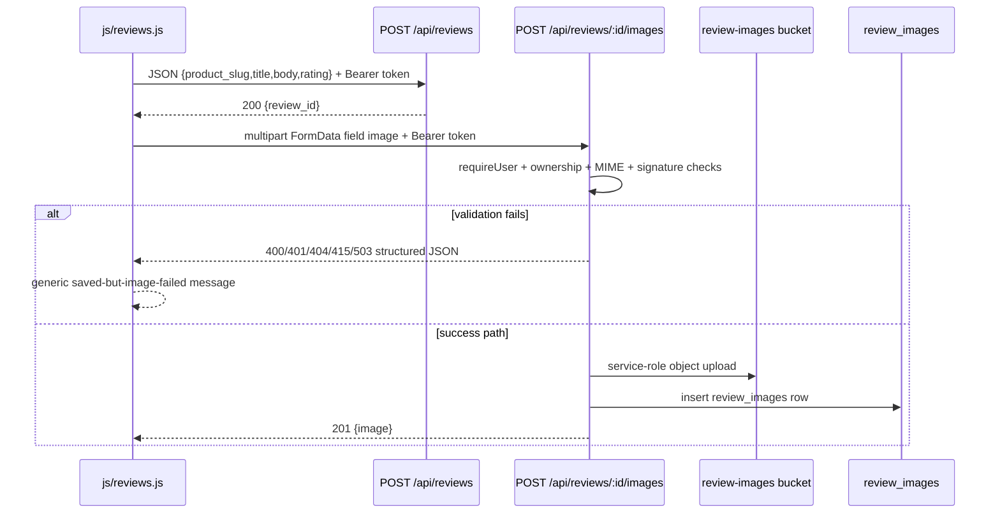

# COSMOSKIN R1B — Review Image Upload Failure After R1 — Plan

**Date:** 2026-07-06  
**Batch:** R1B only (audit + plan)  
**Status:** Plan complete — **not implemented**

---

## Pre-plan git state

```
98f40d9 R1 fix admin review image visibility
5f41c0d docs add R1 admin review image visibility plan
dd604aa updated
```

Working tree clean. **R1 is committed; no R1/R1B mixing.**

---

## Executive summary

After R1, review text saves successfully but image upload fails with the generic PDP message:

> Yorumunuz kaydedildi ancak görsel yüklenemedi.

For a **0.47 MB JPEG (2048×2048)**, this is **very unlikely to be a size-limit issue**. R1 aligned client and server validation to the effective **2 MB** bucket limit; this file is well below that.

Code audit points to a **backend validation / multipart parsing gap** in `uploadReviewPhoto()`, not a wrong endpoint or wrong field name. The most probable failure is **HTTP 400** from server-side MIME validation (`invalid_image_type` or `invalid_image_signature`) or **`missing_image`** if the Workers runtime delivers a `Blob` instead of `File`. Secondary possibilities are **503** from Supabase Storage upload failure or **401** from stale auth token on the second request.

Guest review upload is **not** the cause: guest reviews are not supported anywhere in this flow.

**Implementation is needed.** Smallest safe fix: harden `uploadReviewPhoto()` to sniff image bytes before trusting `file.type`, accept `Blob` uploads, return structured error codes consistently, and make `js/reviews.js` refresh auth + surface server error codes before the generic fallback.

---

## Reported symptom

| Item | Value |
|------|-------|
| Review text | Saves successfully |
| Image upload | Fails after review create/update |
| User-visible error | `Yorumunuz kaydedildi ancak görsel yüklenemedi.` |
| Test file | JPEG, 2048×2048, ~0.47 MB |
| Size hypothesis | Ruled out as primary cause |

---

## Files inspected

| Area | File |
|------|------|
| Production PDP widget | `js/reviews.js` |
| Reviews API | `functions/api/reviews/[[path]].js` |
| Working reference widget | `assets/reviews-widget.js` |
| Auth bootstrap | `assets/auth.js` |
| Reviews schema | `supabase/reviews.sql`, `supabase/phase51_reviews_hardening.sql` |
| R1 tests | `tests/local-integration.test.mjs` |
| R1 delivery report | `COSMOSKIN_R1_ADMIN_REVIEW_IMAGE_VISIBILITY_REPORT_20260706.md` |

**Not inspected live:** production network logs, Supabase storage logs, browser DevTools capture from failing device.

---

## End-to-end trace



---

## Checklist answers

### 1. Does `js/reviews.js` call the correct endpoint?

**Yes.**

```166:170:js/reviews.js
  async function uploadReviewImage(reviewId,item){
    if(!reviewId||!item?.file) throw new Error('Görsel yüklenemedi. Lütfen tekrar deneyin.');
    const form=new FormData();
    form.append('image',item.file,item.file.name||'review-image');
    const res=await fetch(`${API}/reviews/${encodeURIComponent(reviewId)}/images`,{method:'POST',headers:authHeaders(),body:form});
```

`API` resolves to `/api`, so the request is `POST /api/reviews/:reviewId/images`. This matches the router:

```865:867:functions/api/reviews/[[path]].js
    if (parts.length === 2 && parts[1] === 'images') {
      if (method === 'POST') return await uploadReviewPhoto(context, parts[0]);
```

### 2. Does it send the field name expected by `uploadReviewPhoto()`?

**Yes.**

| Side | Field |
|------|-------|
| Client | `form.append('image', file, filename)` |
| Server | `const file = form.get('image')` |

This matches the working `assets/reviews-widget.js` pattern.

### 3. Does the endpoint support guest reviews if review creation supports guest reviews?

**No. Guest reviews are not supported.**

Review creation also requires auth:

```482:485:functions/api/reviews/[[path]].js
async function handleCreateReview(context) {
  assertRateLimit(context, 'reviews-create', 5, 60 * 60 * 1000);
  const required = await requireUser(context);
  if (!required.ok) return required.response;
```

Public list only sets `can_review` when a user id exists:

```478:478:functions/api/reviews/[[path]].js
    can_review: !!user?.id && (hasPurchased || !!userReview)
```

PDP UI blocks submit without session:

```190:190:js/reviews.js
    if(!session){setStatus('Yorum yazmak için giriş yapmalısın.','error');return;}
```

There is no guest review path, no anonymous ownership token, and no one-time upload token.

### 4. Does `uploadReviewPhoto()` require auth while review creation does not?

**No. Both require authenticated users.**

| Step | Auth gate |
|------|-----------|
| `POST /api/reviews` | `requireUser()` → 401 `Oturum gerekli.` |
| `POST /api/reviews/:id/images` | `requireUser()` → 401 `Oturum gerekli.` |

There is no auth mismatch between create and upload by design.

### 5. If customer is not logged in, how is review ownership verified?

**They cannot create a review or upload an image.**

Ownership on upload is enforced here:

```625:627:functions/api/reviews/[[path]].js
  const review = await getReviewById(context, reviewId);
  if (!review || review.user_id !== required.user.id) {
    return json({ ok: false, error: 'Yorum bulunamadı.' }, { status: 404 });
```

### 6. Does Safari/private browsing lose session between review create and image upload?

**Possible but secondary.**

`js/reviews.js` uses a **cached module-level `session`**:

```29:34:js/reviews.js
  async function refreshSession(){
    sb=await waitForSb();
    if(!sb){session=null;return;}
    try{const res=await sb.auth.getSession();session=res?.data?.session||null;}catch{session=null;}
  }
  function authHeaders(){return session?.access_token ? {Authorization:`Bearer ${session.access_token}`} : {};}
```

`submit()` does **not** call `refreshSession()` before create or upload. By contrast, `assets/reviews-widget.js` fetches a fresh token on every upload via async `authHeaders()`.

Because review text already saved, a pure 401 on upload is less likely than backend validation failure, but stale-token risk remains and should be fixed in R1B for Safari/private-mode robustness.

### 7. Does the endpoint reject valid `image/jpeg` files?

**Yes, it can reject otherwise valid JPEGs.**

Current server order of checks:

1. Require multipart `Content-Type`
2. `form.get('image')`
3. `file instanceof File`
4. Trust `file.type` against allowlist `image/jpeg|image/png|image/webp`
5. Size `<= 2 MB`
6. Magic-byte signature check

Problems:

| Issue | Effect |
|-------|--------|
| Multipart part arrives with empty `file.type` | Fails step 4 → **400 `invalid_image_type`** even if bytes are valid JPEG |
| Runtime returns `Blob`, not `File` | Fails step 3 → **400 `missing_image`** |
| Declared MIME and bytes disagree | Fails step 6 → **400 `invalid_image_signature`** |
| Non-standard client MIME like `image/jpg` | Blocked on client before upload; less likely if user reached upload stage |

R1 tests only cover happy-path JPEG with explicit `type: 'image/jpeg'` in Node `File` construction. They do **not** reproduce browser multipart cases where server-side `file.type` is empty or the part is a `Blob`.

### 8. Does backend enforce 2 MB consistently?

**Yes.**

| Layer | Limit |
|-------|-------|
| PDP client `js/reviews.js` | `MAX_MB = 2` |
| `uploadReviewPhoto()` | `file.size > 2 * 1024 * 1024` |
| Bucket `review-images` | `2097152` bytes |

A 0.47 MB file should pass all three.

### 9. Does storage upload succeed?

**Unknown without production logs. Code path can fail here.**

```654:666:functions/api/reviews/[[path]].js
  const upload = await fetch(`${url}/storage/v1/object/review-images/${objectPath}...`, {
    method: 'POST',
    headers: {
      apikey: serviceRoleKey,
      Authorization: `Bearer ${serviceRoleKey}`,
      'Content-Type': file.type,
      'x-upsert': 'false'
    },
    body: bytes
  });
  if (!upload.ok) {
    console.error('review_image_upload_failed', { status: upload.status, reviewId });
    return json({ ok: false, error: 'Görsel yüklenemedi. Lütfen tekrar deneyin.' }, { status: 503 });
  }
```

If validation passes but storage fails, customer sees the same generic PDP message. Service-role upload bypasses customer storage RLS, so this is less likely than validation failure but still possible if env/config/storage API errors occur.

### 10. Does `review_images` insert succeed?

**Only after storage upload succeeds.**

Insert uses service role and should bypass RLS. If insert throws, outer handler returns **500** with generic server message. Current code does not roll back uploaded storage object on insert failure.

### 11. What status code is most likely?

| Status | Code / error | Likelihood for reported bug |
|--------|----------------|-----------------------------|
| **400** | `missing_image` | Medium |
| **400** | `invalid_image_type` | **High** |
| **400** | `invalid_image_signature` | Medium |
| **401** | `Oturum gerekli.` | Low (review already saved) |
| **404** | `Yorum bulunamadı.` | Low |
| **415** | `invalid_content_type` | Low |
| **429** | rate limit | Low on first upload |
| **503** | storage upload failed | Medium |
| **500** | unhandled insert/parse failure | Low-medium |

**Most probable exact failing reason (code-level):**

> `uploadReviewPhoto()` rejects the multipart upload during server-side file validation **before storage upload**, most likely **`invalid_image_type`** because it trusts `file.type` before sniffing bytes, and/or **`missing_image`** because it requires `instanceof File` instead of accepting `Blob`.

This is **not proven from live network capture yet**; it is the strongest explanation consistent with a valid sub-2MB JPEG and the current implementation.

---

## Request / response details

### Client request

| Item | Value |
|------|-------|
| Method | `POST` |
| URL | `/api/reviews/{reviewId}/images` |
| Auth | `Authorization: Bearer <supabase access token>` |
| Body | `multipart/form-data` |
| Field name | `image` |
| Manual `Content-Type` | Not set by client (correct) |

### Server success response

| Item | Value |
|------|-------|
| Status | `201` |
| Body | `{ ok: true, review_id, image }` |

### Server failure response shape

Validation failures use:

```129:130:functions/api/reviews/[[path]].js
function validationError(message, code = 'validation_error', status = 400) {
  return json({ ok: false, code, error: message }, { status });
```

Examples:

| Failure | HTTP | `code` | `error` |
|---------|------|--------|---------|
| Missing auth | 401 | — | `Oturum gerekli.` |
| Review not owned | 404 | — | `Yorum bulunamadı.` |
| Not multipart | 415 | `invalid_content_type` | multipart required |
| Missing file part | 400 | `missing_image` | `Görsel dosyası gerekli.` |
| MIME not allowed | 400 | `invalid_image_type` | `Desteklenmeyen görsel formatı.` |
| Signature mismatch | 400 | `invalid_image_signature` | `Desteklenmeyen görsel formatı.` |
| Too large | 400 | `image_too_large` | `Görsel boyutu çok büyük.` |
| Storage failure | 503 | — | `Görsel yüklenemedi. Lütfen tekrar deneyin.` |

### Customer-facing error mapping gap

`js/reviews.js` maps some server codes inside `uploadReviewImage()`, but `submit()` **always replaces any upload failure** with the generic saved-but-failed message:

```204:209:js/reviews.js
        try{
          await uploadSelectedImages(data.review_id||userReview?.id);
        }catch(error){
          setStatus('Yorumunuz kaydedildi ancak görsel yüklenemedi.','error');
```

So operators cannot tell from UI whether the failure was 400 MIME, 401 auth, 404 ownership, or 503 storage.

---

## Auth / ownership behavior

| Concern | Current behavior |
|---------|------------------|
| Guest reviews | Not supported |
| Review create auth | Required |
| Image upload auth | Required |
| Ownership check | `review.user_id === auth user id` |
| Guest image token | None |
| Private browsing | Same auth rules; stale cached token risk in `js/reviews.js` |
| Admin moderation | Unchanged |

Expected behavior alignment:

- Since guest reviews are **not** allowed, **no guest image upload work is needed**.
- UI already blocks unauthenticated review submit.
- R1B should **not** add guest upload tokens unless product policy changes.

---

## Storage behavior

| Item | Behavior |
|------|----------|
| Bucket | `review-images` (public) |
| Upload actor | Service role from Pages Function |
| Object path | `{user_id}/{review_id}/{uuid}.{ext}` |
| Customer storage RLS | Not used on this path |
| Bucket size limit | 2 MB |
| Upload content type | Uses `file.type` from multipart part |

Risk: if server-side `file.type` is empty after validation changes, storage upload may send blank `Content-Type`. R1B should set content type from sniffed MIME, not only from `file.type`.

---

## DB insert behavior

| Item | Behavior |
|------|----------|
| Table | `review_images` |
| Insert actor | Service role |
| Insert timing | After storage upload only |
| Row fields | `review_id`, `storage_path`, `public_url`, `status: pending` |
| Failure effect | 500 if insert throws after storage upload |

No migration needed.

---

## Secondary risks checked

| Risk | Finding |
|------|---------|
| Wrong endpoint | Ruled out |
| Wrong FormData field | Ruled out |
| Guest/auth mismatch | Ruled out |
| 2 MB mismatch | Ruled out for 0.47 MB file |
| Missing `review_id` in create response | Possible edge case; add fallback to `data.review?.id` |
| Retired endpoint still used | Ruled out in R1 |
| Admin visibility | Separate issue; not cause of upload failure |

---

## Recommended smallest safe fix (R1B)

### A. Backend — `functions/api/reviews/[[path]].js`

1. Replace `instanceof File` check with safe blob acceptance:
   - Accept `Blob` with `size > 0`
2. Read bytes once, sniff format, derive canonical extension/MIME from magic bytes.
3. Use sniffed MIME/extension as source of truth when `file.type` is empty, `application/octet-stream`, or alias like `image/jpg`.
4. Keep 2 MB limit and existing ownership/auth checks unchanged.
5. Return structured `{ ok: false, code, error }` for all upload failures, including storage failures with safe `code` such as `storage_upload_failed`.
6. Log only non-sensitive debug fields server-side (`code`, `reviewId`, `declaredType`, `sniffedType`, `size`, storage status).

### B. Frontend — `js/reviews.js`

1. Refresh auth immediately before create + upload (`refreshSession()` or async auth headers like `reviews-widget.js`).
2. Resolve review id defensively: `data.review_id || data.review?.id || userReview?.id`.
3. Preserve server error detail in UI:
   - Keep generic headline when review already saved
   - Append safe server message/code for debugging, e.g. `(... Desteklenmeyen görsel formatı.)`
4. Do not allow image attachment UI for logged-out users (already true).

### C. Tests / validator

Add R1B coverage for:

- JPEG upload with empty `file.type` but valid magic bytes → 201
- Blob multipart part accepted
- `image/jpg` alias accepted via sniffing
- 0.47 MB JPEG passes
- structured 400 codes returned
- client uses refreshed auth before upload

---

## Whether implementation is needed

**Yes.**

R1 fixed the persistence route, but production still fails on valid images. The remaining bug is in upload validation / multipart handling and error observability, not in admin rendering.

---

## Files to change (implementation phase)

| File | Change |
|------|--------|
| `functions/api/reviews/[[path]].js` | Harden `uploadReviewPhoto()` validation and structured errors |
| `js/reviews.js` | Refresh auth before upload, better review id fallback, surface safe server error |
| `tests/local-integration.test.mjs` | Add R1B regression cases |
| `scripts/validate-r1-admin-review-image-visibility.mjs` or new `scripts/validate-r1b-review-image-upload-failure.mjs` | Guard sniffing / Blob acceptance / no guest-token regression |

**Do not change:**
- migrations / SQL
- storage bucket config / RLS
- admin auth / RBAC
- coupon / checkout / refund / inventory / bank transfer / email
- guest-review product policy (not supported today)

---

## Verification plan after implementation

1. Reproduce with the reported JPEG on a real PDP in Chrome + Safari normal + private mode.
2. Confirm network shows `POST /api/reviews/:id/images` → `201`.
3. Confirm `review_images` row exists and admin thumbnail renders.
4. Confirm invalid type still returns structured `400`.
5. Confirm text-only review still works.
6. Run R1 + R1B validators and full `tests/local-integration.test.mjs`.

---

## Deferred

- Backfill/repair for reviews already saved without images during R1 failure window.
- Guest/anonymous review image support (not current product behavior).
- Private-bucket signed URL migration (unchanged from R1).

---

**Stop here. Plan only. No implementation in this batch.**
