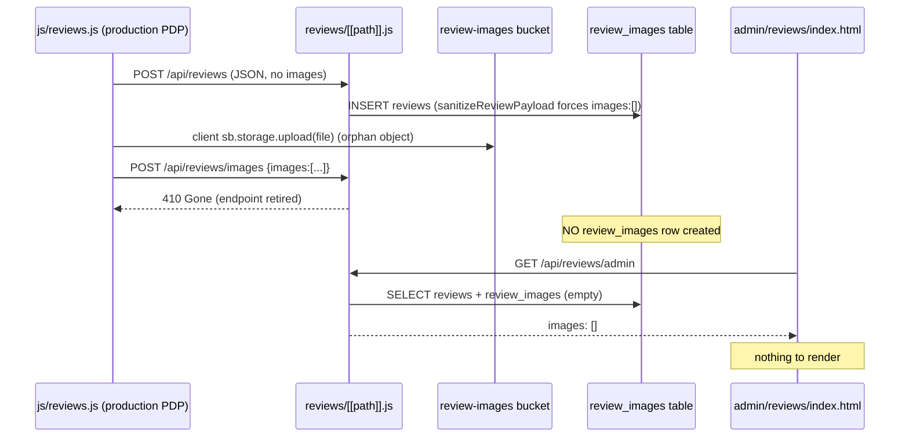

# COSMOSKIN R1 — Admin Review Image Visibility Bug — Plan

**Date:** 2026-07-06  
**Batch:** R1 only (audit + plan)  
**Status:** Plan complete — **not implemented**

---

## Pre-plan git state

```
dd604aa updated                                  ← I1 implementation (committed)
63de7bd docs add I1 inventory checkout blocking plan
4dd8a34 C1B2 admin coupon metadata visibility
```

Working tree clean. **I1 is committed; no I1/R1 mixing.**

---

## Executive summary

Customer review photos do not appear in the admin panel. The root cause is **not** an admin display or signed-URL bug — it is that **review images are never persisted to the database on the production PDP path**. The production PDP review widget (`/js/reviews.js`) posts image metadata to a **retired endpoint that returns 410 Gone**, and the create/update payload sanitizer **hard-codes `images: []`**, so no `review_images` rows are ever inserted. With no DB rows, the admin API returns empty `images[]` and the admin UI has nothing to render.

A secondary latent risk exists (no signed-URL fallback + no broken-image fallback in admin UI), but the bucket is currently **public**, so display works once rows exist. The smallest safe fix is to **repair the persistence path**, not to change storage or RLS.

---

## Files inspected

| Area | File |
|------|------|
| Reviews API (all routes) | `functions/api/reviews/[[path]].js` |
| Production PDP widget | `js/reviews.js` |
| Alternate widget (not on PDPs) | `assets/reviews-widget.js` |
| Legacy snippet | `snippets/reviews-component-ready.html` |
| Admin reviews UI | `admin/reviews/index.html` (inline script) |
| Admin route allowlist | `assets/admin-runtime.js` |
| Reviews schema | `supabase/reviews.sql`, `supabase/schema.sql` |
| Reviews hardening / bucket | `supabase/phase51_reviews_hardening.sql` |
| Signed URL helper (H2) | `functions/api/_lib/return-attachments.js`, `functions/api/_lib/supabase.js` (`createSignedStorageUrl`) |
| Admin returns comparison | `functions/api/admin/returns.js`, `assets/admin-returns.js` |
| Account signed URL comparison | `functions/api/account/summary.js`, `assets/account-dashboard.js` |

**Not inspected / out of scope:** admin auth/RBAC/JWT/session, Cloudflare files, coupon, checkout, refund, inventory, bank transfer, email, product pricing.

---

## 1. Upload path

| Question | Finding |
|----------|---------|
| Are review images uploaded? | Files may reach storage from `js/reviews.js` client upload, but **DB rows are not created** on the PDP path |
| Which endpoint uploads? | Canonical working endpoint: `POST /api/reviews/:reviewId/images` (multipart, field `image`) — `uploadReviewPhoto()` lines 577–634 |
| Bucket | `review-images` |
| Storage path | API: `{user_id}/{review_id}/{uuid}.{ext}` (line 609); client: `{user_id}/{review_id}/{ts}-{i}.webp` |
| Customer-scoped path? | Yes — first folder = `auth.uid()` |
| Paths stored in DB? | Only when `uploadReviewPhoto` (multipart) or `insertReviewImages` runs; **PDP path never triggers a successful insert** |

**Validation (`uploadReviewPhoto`):**
- Types: `image/jpeg`, `image/png`, `image/webp` (magic-byte checked)
- Max size: **5 MB (API)** — but **bucket enforces 2 MB** (mismatch)
- Max count: 5 per review

---

## 2. Database persistence

| Question | Finding |
|----------|---------|
| Where image refs stored | `review_images` table — **separate rows**, not JSONB |
| Columns | `id`, `review_id` (FK CASCADE), `storage_path`, `public_url`, `status` (`pending`/`approved`/`rejected`), `width`, `height`, `created_at`, moderation cols |
| Admin API reads refs? | Yes via PostgREST embed `review_images(id,public_url,status,width,height,created_at)` (line 14) |
| Model | One-to-many `reviews ← review_images` |
| Old/broken records | Existing reviews from PDP path likely have **zero** `review_images` rows (orphaned storage objects possible) |
| Migration needed? | **No schema migration** — table + columns already exist and are sufficient |

**Note:** `REVIEW_SELECT_WITH_IMAGES` (line 14) does **not** select `storage_path`, so admin list responses expose only `public_url` (good — no raw path leak in lists).

---

## 3. Storage access

| Question | Finding |
|----------|---------|
| Bucket public/private? | **Public** (`review-images`, `public = TRUE`, `phase51_reviews_hardening.sql`) |
| Admin signed URLs? | **None** — reviews use `public_url` (`/storage/v1/object/public/...`) |
| Public URL used correctly? | Yes, when rows exist |
| RLS blocking admin? | No — API uses **service role** (bypasses RLS); public read policy is world-readable |
| Missing `/storage/v1/object/sign/` (H2-style bug)? | **N/A** — reviews never sign; the H2 signing bug does not apply |
| Signed URLs expiring too soon? | N/A (no signing) |
| Raw paths as `src`? | Admin renders `public_url` (a full public URL), not a raw object key — acceptable while bucket is public |

**Conclusion:** Storage/RLS are **not** the blocker. No bucket or RLS change is required for the primary fix.

---

## 4. Admin API

`GET /api/reviews/admin` → `handleAdminList()` (lines 673–685):
- `assertAdmin(context)` gate
- Selects `REVIEW_SELECT_WITH_IMAGES`, maps via `mapReview()` → `mapImage()`
- Returns `images[]` with `{ id, url (=public_url), public_url, status, width, height, created_at, storage_path:null }`

| Question | Finding |
|----------|---------|
| Includes image data? | Yes — but only if `review_images` rows exist |
| Raw paths only? | No — returns `public_url` |
| Signed URLs? | No |
| Thumbnail URLs? | No (uses `url`/`public_url` for both) |
| Accidental filtering? | Admin list uses `mapReview(review)` **without** `publicOnly`, so pending images are included (correct for moderation) |
| Status hides images? | No — admin sees all statuses |
| Enough metadata? | Missing `filename`, `mime_type`, `size_bytes` vs the target shape (nice-to-have, not blocking) |

---

## 5. Admin UI

`admin/reviews/index.html` (inline script):
- `loadReviews()` → `api('/admin')` (lines 2117–2118)
- `renderImageCard()` (lines 2006–2028): `` inside a `media-thumb` button
- Click-to-open: `openLightbox(image.url, ...)`
- **No `onerror` handler / no “Görsel yüklenemedi” fallback** (unlike `admin-returns.js` and `account-dashboard.js`)

| Question | Finding |
|----------|---------|
| Where rendered | `renderImageCard()` in admin reviews inline script |
| Image fields ignored? | No — reads `image.url` (mapped from `public_url`) |
| Wrong field name? | No — API and UI agree on `url` |
| Wrong `src`? | No |
| CSS hiding? | No evidence |
| Broken-image state? | **Missing** |
| Click-to-open full image? | Yes (lightbox) |

**Conclusion:** UI would display correctly if the API returned images. The only UI gaps are robustness (fallback) and future-proofing (signed URLs).

---

## 6. Exact bug cause



**Primary root cause (blocking):**
1. `js/reviews.js` (production PDP) registers uploaded images via `POST /api/reviews/images` → **410 Gone** (API lines 790–792).
2. `sanitizeReviewPayload()` hard-codes `images: []` (line ~294), so `handleCreateReview` / `handleUpdateReview` insert **no** image rows even when a payload includes images.
3. Result: `review_images` empty → admin API `images: []` → admin UI blank.

**Working path exists but unused:** `assets/reviews-widget.js` uses the correct multipart `POST /api/reviews/:reviewId/images`, but PDPs load `js/reviews.js`, not this widget.

**Secondary (latent, non-blocking) issues:**
- Size mismatch: API allows 5 MB, bucket rejects >2 MB.
- No signed-URL helper for reviews (fine while public; breaks if bucket made private).
- Admin UI lacks broken-image fallback.

---

## 7. Recommended implementation plan (smallest safe fix)

### Primary backend fix (required)

Make the review images actually persist through the endpoints the production PDP uses. Two safe options — **prefer Option A**:

**Option A — Point PDP at the working multipart endpoint (least server change):**
- Update `js/reviews.js` to upload via `POST /api/reviews/:reviewId/images` (multipart), mirroring `reviews-widget.js` `uploadPhoto()`.
- Removes reliance on the retired `/api/reviews/images` and the stripped JSON `images` field.
- No change to `sanitizeReviewPayload` needed.

**Option B — Re-enable server-side JSON image registration:**
- Have `handleCreateReview` / `handleUpdateReview` honor a sanitized `images[]` (validate `storagePath` is customer-scoped `{uid}/{reviewId}/...`, derive `public_url` server-side) via `insertReviewImages`.
- Higher risk (trusts client-provided storage paths); requires strict path validation.

### Admin API enrichment (recommended, safe)

- Add `storage_path` (already in DB) to enrichment and produce a normalized image object:
  ```json
  { "path": "...", "signed_url": "...", "thumbnail_url": "...", "filename": "...", "mime_type": "...", "size_bytes": 12345 }
  ```
- Since bucket is public, `signed_url` can equal `public_url` today; wire through `createSignedStorageUrl()` helper so a future private-bucket switch needs no admin change. **Do not** change the bucket to private in R1.

### Frontend fix (admin UI, recommended)

- In `renderImageCard()`, prefer `image.signed_url || image.url`, add `` → “Görsel yüklenemedi” fallback card (mirror `admin-returns.js` / `account-dashboard.js`).
- Keep lightbox open behavior and moderation flow unchanged.

### Storage / RLS

- **No change needed.** Bucket already public; service-role admin reads already work. Do not weaken RLS or flip bucket visibility.

### Migration

- **Not needed.** `review_images` schema already has `storage_path`, `public_url`, `status`, dimensions.

### Size-mismatch cleanup (optional, low risk)

- Align API max (5 MB) with bucket limit (2 MB) or raise bucket limit — but bucket limit change is a storage config change; **defer unless explicitly approved**. Safest: lower API/client to 2 MB to match bucket.

---

## 8. Validator plan

Create: **`scripts/validate-r1-admin-review-image-visibility.mjs`**

Must **fail** if:
- Review image paths are stored but admin API (`handleAdminList`) does not return `images[]` with URLs.
- Private storage paths are rendered directly as `` (raw object key, not a public/signed URL).
- Signed URLs are not generated for review images **when bucket is private** (guard reads bucket config marker).
- A generated signed URL path misses `/storage/v1/object/sign/` (reuse H2 assertion).
- Admin reviews UI ignores returned image fields (must reference `signed_url`/`url`).
- Admin reviews UI has no thumbnail render or no broken-image fallback (`onerror` / “Görsel yüklenemedi”).
- Review image bucket is switched to public unsafely (marker check — must stay as-is unless intentional).
- RLS is weakened broadly (no new permissive `USING (true)` on `storage.objects`/`review_images` beyond existing).
- The retired `POST /api/reviews/images` 410 branch is removed without a working replacement wired into `js/reviews.js`.
- **Regression chain (must all pass):**
  - `validate-h2-return-attachment-preview.mjs` (signed URL helper)
  - `validate-h1-return-attachment-storage-rls.mjs`
  - `validate-h0-live-payment-rpc-hotfix.mjs`
  - `validate-i1-inventory-checkout-blocking.mjs`
  - `validate-c1-coupon-eligibility-hardening.mjs` / `validate-c1b2-*`
  - `validate-d3-refund-snapshot-persistence.mjs`, `validate-d2b-*`, `validate-d2-*`, `validate-d1-*`
  - `validate-a1-admin-rbac-hardening.mjs` (admin auth/RBAC)

Scope guard: validator must assert R1 did **not** modify admin auth/RBAC/JWT/session, coupon, checkout, refund, inventory, bank transfer, or email files.

---

## 9. Test plan

### Upload / persistence
- Customer review with one image creates one `review_images` row (path + public_url).
- Multiple images (≤5) create all rows.
- Invalid file type rejected (`unsupported_type`).
- Oversized image rejected (align to bucket 2 MB limit).
- Retired `/api/reviews/images` still returns 410 **and** PDP path no longer depends on it.

### Admin API
- `GET /api/reviews/admin` returns normalized image objects.
- Public bucket: `signed_url`/`url` present and resolvable.
- Missing image path handled safely (no crash, empty `images[]`).
- Broken storage object handled safely (fallback marker, not raw path).
- If bucket private: signed URL contains `/storage/v1/object/sign/` and `token=`.

### Admin UI
- Review card shows thumbnail from `signed_url || url`.
- Multiple images render as grid.
- Broken image shows “Görsel yüklenemedi”.
- Click opens full image (lightbox/new tab).
- No raw private object key rendered as final `src`.

### Security
- Customer cannot read another customer’s image via raw path (RLS owner-folder + no raw path exposure).
- Admin can view via `assertAdmin`-gated endpoint.
- Signed URL expires (if used).
- No broad public bucket change.

### Regression
- Review submit + moderation still work.
- H2 return attachment previews still work.
- Admin auth/RBAC still works.
- I1 inventory checkout blocking still works.
- C1 coupon hardening still works.
- D1/D2/D2B/D3A still pass.

---

## 10. Implementation sequence

| Step | Scope | Files (expected) |
|------|-------|------------------|
| **R1A** | Repair PDP persistence (Option A: multipart upload) | `js/reviews.js` |
| **R1B** | Admin API image normalization + signed-URL-ready enrichment | `functions/api/reviews/[[path]].js` |
| **R1C** | Admin UI thumbnail + fallback | `admin/reviews/index.html` |
| **R1D** | Validator + tests | `scripts/validate-r1-admin-review-image-visibility.mjs`, `tests/local-integration.test.mjs` |
| **R1E** | Docs (report/changed-files/runbook/rollback) | on implementation |

Dependency order: R1A (persistence) before R1C (UI) is meaningful; R1B enables future private-bucket switch; R1D last.

**Deferred:** bucket size/visibility changes, thumbnail generation service, migration of orphaned storage objects, snippet/legacy widget cleanup, README correction.

---

## 11. Rollback plan (for future R1 implementation)

1. Revert R1 commit(s) — all changes are code-only (`js/reviews.js`, reviews API enrichment, admin UI, validator/tests).
2. No DB rollback — R1 adds no migration.
3. No storage rollback — bucket/RLS unchanged.
4. Verify: `node scripts/validate-h2-return-attachment-preview.mjs`, `node scripts/validate-i1-inventory-checkout-blocking.mjs`, `node --test tests/local-integration.test.mjs`.
5. Smoke: submit a review with a photo → confirm `review_images` row → confirm admin thumbnail.

---

## 12. What R1 does NOT change

- Admin auth / RBAC / JWT / session files
- Cloudflare files
- Coupon (C1), checkout, refund (D1/D2/D2B/D3A), inventory (I1), bank transfer (B1/B2), email
- Product pricing
- Bucket visibility / broad RLS
- No migration, no SQL run, no deploy

---

*End of R1 plan. No files were modified. No migrations. No SQL. No deploy. Implementation not started.*
